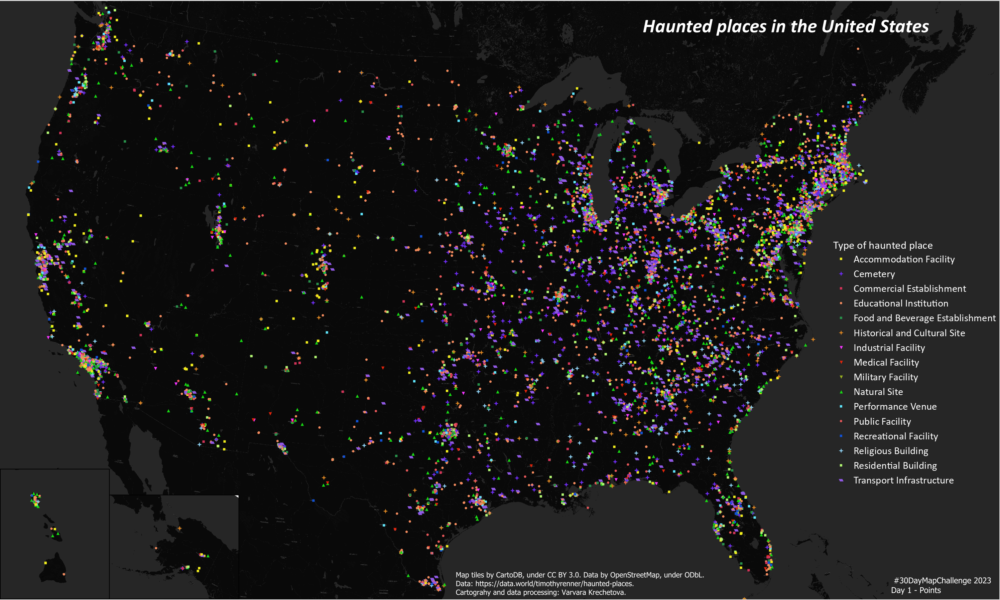

The folder contains code for map I made for 30 Days Map Challenge 2023 (https://30daymapchallenge.com/).  Since the challege started right after Halloween and Día de Muertos, i tried OpenAI’s GPT-4 model for classifying large amount of textual data to make them suitable for map making.
To make the map below, I used the geocoded dataset of haunted places in USA 👻 from Tim Renner (https://data.world/timothyrenner/haunted-places). The dataset has column with names or short description of haunted places and I used GPT-4 model to infer a sensible taxonomy of the places and then classifying all over 10,000 of the places into this taxonomy. The model was able to classify correctly even places with ambiguous names I needed to google to find what they were. However, you need to be very detailed and specific in your prompt to ensure the desired response. To compare, I tried GPT-3.5 (ChatGPT) with the same prompts and the results were less reassuring. 

